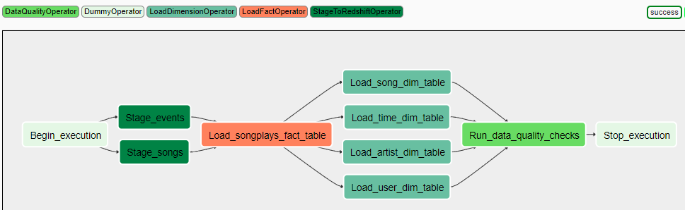

# Data pipeline for Sparkify

This project aims at creating data warehouse on AWS Redshift for `Sparkify` startup company. The data will be loaded to the data warehouse using Apache Airflow data pipeline. This data warehouse will provide ad-hoc analytical capabilities to analyze songplay data by their users.

## Table of Contents

- [Technologies used](#Technologies-used)
- [Source data information](#Source-data-information)
- [Data Model](#Data-Model)
- [ETL Processing](#ETL-Processing)
- [Project Files](#Project-Files)
- [Sample Data](#Sample-Queries-on-Sparkify)
- [References](#References)

## Technologies used

- Python
- AWS Redshift
- AWS S3
- Apache Airflow

## Source data information

There are two set of source files available for processing. `song_data` and `log_data`.
both the datasets are present on AWS S3 buckets.
song_data is present at 's3://udacity-dend/song_data'
log_data is present at 's3://udacity-dend/log_data'

### song_data
set of files that contains metadata about songs.
- single file contains metadata about a single song.
- json format.
- sample data:

### log_data
set of files that contains transactional data about the songs played in the app by various users.
- single file contains transactional data for a given day. a list of json data records are present in the file.
- json format.
- sample data:

## Data Model
    Data is modeled in form of STAR schema tables in AWS Redshift .
    `SPARKIFYDB` database contains the below tables:

    `SONGPLAYS` table is a Fact table containing all the songs played by various users of the app.
    `TIME`,`SONGS`,`USERS` and `ARTISTS` tables are Dimentsion tables containing metadata about the songplay data.
    `SONGS_STAGING` and `EVENTS_STAGING` tables are staging tables that hold the data coming in from S3.
    
Below is the ER diagram which provides more details about the database tables:

## ETL Processing

### Data Profile:

* songs and artists tables are populated from the `song_data` source file. 
* Data profiled shows that `year, artist_location, artist_latitude and artist_longitude` are not always present. 
* An Artist could have multiple songs. some song_names have special characters in the source file encoded in utf8 format and target database is set to the same in order to preserve data accuracy. 
* Users, time and songplay tables are populated from the `log_data` source file(except for user_id and artist_id which are linked from songs and artists table respectively).
* A user could have multiple songplays.

### Data Pipeline
* Below is Apache Airflow data pipeline:

* There are 4 sub DAGs operators defined here:
`STAGETOREDSHIFT` - Copies data from S3 files to Redshift staging tables. inputs are source file and target staging table names.
`LOADFACT` - Loads the SONGPLAYS fact table from the staging table. 
`LOADDIMENSION` - Loads Dimension tables from staging tables. inputs are staging select query and target database_name and table_name.
`DATAQUALITY` - Runs the data Quality checks on the tables populated. RI check, Invalid user level in the table are currently added.

* DAG runs daily, loading the daily events into the staging_events table. Also - it refreshes the staging_songs data in case there were any changes to the underlying source.

## Project Files
    `create_tables.py` and `sql_queries.py` are used to create the required database schema as per the model and has insert queries for the respective tables.
    `operators` folder contain the sub DAGs.
    `udac_example_dag.py` contain the main DAG file for Apache Airflow.
    
## Sample Queries on Sparkify
Below Query shows top 5 hours where the most number of songs are played.

Below Query shows top 5 users monthwise. (As the data is present for 2018-11 only - that is what we see in the output)

## References

* https://airflow.apache.org/docs/stable/scheduler.html
* https://airflow.apache.org/docs/stable/faq.html
* https://www.lucidchart.com